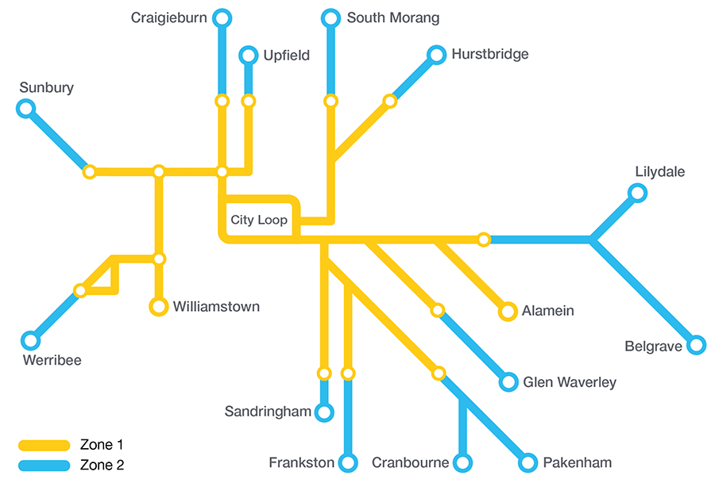

# Train Network System Assignment Specification


The purpose of this project is familiarise with declarative logic programming for problem solving and knowledge-intensive decision making, and to get you used to thinking as a "logic programmer".

In particular, the project involves incrementally building a system to reason about a train network system, so that decisions are made on how to route trains can be supported.

 <p align="center">
    

 </p>

-------------------

## Overview


** Task** is to develop an train network system to support route decision making for different trains in a map, by completing the various exercises below.


## Exercise 1: Train Network System Database -

A database can be naturally represented in Prolog as a set of facts. Create a Prolog database to hold all the information in file [train.data](trainCanada.data) regarding links, stop-overs, and train types. You may need to do some syntax adaptations to fit Prolog syntax.

Then, relying on your design for the train Prolog database, you are to provide the following interface to it:

The query

```prolog
?- link(From, To, SpeedLimit, Length).
```

must produce all the possible links in both directions with the speed limit in km/h and the length in km. Note that your database should only list each link once.

The query

```prolog
?- city(City, StopOvers).
```

must produce all the cities with the stop-over times in minutes. Here `StopOvers` is a list of terms `stop(TrainType, Time)`, where `TrainType` is the type of the train and `Time` is the stop-over time in minutes.

The query

```prolog
?- train(Type, MaxSpeed).
```

must produce both train types with their maximum speed in km/h.

Here is an example of a query and its result for the given database:

```prolog
?- link(toronto,X,150,Z).
X = north_bay,
Z = 350 ;
X = hamilton,
Z = 60.
```

If instead of `150` in the third argument you use a Prolog variable, you should get more connections.

Build and place your knowledgebase in the Prolog file [`network_ontario.pl`](network_ontario.pl).

Then, for each of questions listed below, write a Prolog query (not a predicate!) that will answer the question using the interface `link/4`, `city/2`, and `train/2` defined above. For this task, you may not use helper predicates or the exclusions mentioned above (see Language Restrictions). Note that your queries must still work if we are given a different train data file for a different train system with the same interface. For each, show the query and its result when you run it. Remember you can run over all solutions of a query by pressing `;` after each solution.

1. What links have a speed limit of 100 km/h or less?
2. What cities are directly connected to Toronto?
3. What pairs of distinct cities can be connected using exactly two links? (Only show the first five answers when running the query.)
4. On which links can a passenger train travel at its maximum speed?
5. Which city is the closest one to Toronto?

Place your answers in file [`EXERCISE_01.md`](EXERCISE_01.md).

### Additional task 

 As part of this exercise, you should also produce at least one interesting network instance that you plan to use for testing. You can use a totally fictitious network or rely on any existing real-world network. Use file name [`test_network.pl`](test_network.pl) to encode your test network.

Using file [`test_network.md`](test_network.md), explain what interesting features your network have, and how it is a good network to test your system effectively. You may modify your network example as you progress in the project and re-submit this part in the final submission.

## Exercise 2: Basic path reasoning tools - 5%

A **route path** will be described by the list of cities it traverses. For example, if we plan a freight train route from Toronto to Ottawa via Kingston and Brockville, we would write this route as a list `[toronto,kingston,brockville,ottawa]`.

In this part you should implement the following predicate tools:

- `well_formed/1`, where `well_formed(++Path)` is true whenever `Path` is a well-formed legal path, in that there is a indeed link in the network between each consecutive cities in the path.
- `non_redundant/1`, where `non_redundant(++Path)` is true whenever `Path` is _non-redundant_, in that it has no unnecessary loops, that is, it never goes through the same city more than once.
- `acceptable/3`, where `acceptable(++Path, ++Type, ++Duration)` is true whenever `Path` is a well-formed and non-redundant path and with no stop-over longer than `Duration` minutes for a train of type `Type`.

Place your answers in file [`train_network.pl`](train_network.pl).

## Exercise 3: Basic routes - 30%

In this exercise and the following ones, we will extend the train railway knowledge developed above. In particular, you are going to write Prolog code that will find ways to plan routes for freight and passenger trains on our railway system. The same language restrictions apply---consult the forum if in doubt. Your code for all the exercises should work for _any_ train network specified via the interface in Exercise 1, namely, `link/4`, `city/2`, and `train/2`.

First some definitions and notation:

* **Route Path:** a route will be described by the list of cities it traverses. For example, if we plan a freight train route from Toronto to Ottawa via Kingston and Brockville, we would write this route as a list `[toronto,kingston,brockville,ottawa]`.
* **Route Length:** the length of a route is simply the sum of the lengths of the links traversed by this route. The length is always an integer and is expressed in km.
* **Route Duration:** the duration of a route depends on the speed limit on each link, the maximum speed at which a particular train can travel, and the stop-over in intermediate cities.
  * For example, a freight train may go up to a certain speed because it costs too much in fuel to travel any faster, and reducing costs is a key concern for freight trains. Passenger trains, on the other hand, are much lighter and the priority is to get the passengers to a destination as fast as possible, so they may be allowed to travel faster.
  * The speed limit on each link indicates how fast any train can travel on that link without risk of derailing. When you calculate the duration of a route, assume that trains always travel as fast as possible on each link, that is, at the least of their own maximum speed and the link's speed limit.
  * Thus, the duration of a route is the sum of the time it takes to traverse each link, plus the stop-over time at each city in the path, excluding the end points.
  * Note that stop-overs are time stopping in a city _on the way to another destination_. If it is zero (0), it means there is no stop-over time in such city. However, the train can have that as the actual destination (or origin). That is why we do not account for stop-overs at the two endpoints.
  * Finally, the duration is expressed in hours and always as a float. To make sure and expression yields a float, one can always add `0.0` (e.g., `X is 3 + 0.0` will yield `X = 3.0`).

In the most classical use case, when planning a route for a particular train, we have an origin city, a destination city, and the type of train we are planning this route for. Given these as input, we would like to find a route and give its path, length and duration. Other times, we may have the origin city and the train type, and would like to extract all possible destinations that could be reached from that city (and how). Yet other times, we may be interested to know all the possible paths for a given train type.

Write a predicate `route/6`:

```prolog
route(?Origin, ?Destination, ?TrainType, -Path, -Length, -Duration)
```

that holds _iff_ `Path` is a _non-redundant_ path from `Origin` to `Destination` of length `Length` which would take `Duration` hours for a train of type `TrainType` to traverse.

A _non-redundant path_ is one which has no unnecessary loops, that is, it never goes through the same city more than once from the origin to the destination.

For example, the query:

```prolog
?- route(toronto, montreal, Type, Path, Length, Duration).
```

would yield, as one of a number of answers:

```prolog
Type = passenger
Path = [toronto, north_bay, ottawa, cornwall, montreal]
Length = 880
Duration = 6.133333333333333
```

while the following query would yield just one answer:

```prolog
?- route(montreal, montreal, freight, Path, Length, Duration).
Path = [montreal]
Length = 0
Duration = 0
```

Place your answers in file [`train_network.pl`](train_network.pl).

## Exercise 4: Bounded routes - 30%

The `route/6` predicate above is useful in finding _a_ route between two cities, but it has a severe limitation for decision making use, in that it doesn't discriminate between fast and slow routes. In our railway planning, we want to find the fastest route, or at least a reasonably fast route.

Write a predicate `bounded_route/7`:

```prolog
bounded_route(?Origin, ?Destination, ?TrainType, ++Limit, -Path, -Length, -Duration)
```

which works like `route/6` but only holds if `Duration` is less than `Limit`.

For example:

```prolog
?- bounded_route(toronto, montreal, passenger, 8, Path, Length, Duration).
Path = [toronto, kingston, brockville, cornwall, ottawa, alexandria, montreal],
Length = 720,
Duration = 4.461111111111111 ;
Path = [toronto, kingston, brockville, ottawa, alexandria, montreal],
Length = 650,
Duration = 4.161111111111111 ;
Path = [toronto, north_bay, ottawa, alexandria, montreal],
Length = 900,
Duration = 6.0777777777777775 ;
Path = [toronto, kingston, brockville, cornwall, montreal],
Length = 540,
Duration = 2.966666666666667 ;
Path = [toronto, north_bay, ottawa, brockville, cornwall, montreal],
Length = 1010,
Duration = 6.933333333333333 ;
Path = [toronto, kingston, brockville, ottawa, cornwall, montreal],
Length = 630,
Duration = 4.216666666666667 ;
Path = [toronto, north_bay, ottawa, cornwall, montreal],
Length = 880,
Duration = 6.133333333333333 ;
false.
```

While you are not meant to go beyond reasonable limits and you should stay within the language restrictions, your solution needs to be reasonably efficient and not based on mere brute force. Consider your system may be used in huge networks with lots of connections! ;-)

However, it is very interesting to think first what would be the shortest, simplest, solution for this predicate, *can you say?*

Place your answers in file [`train_network.pl`](train_network.pl).

## Exercise 5: Fastest routes - 30%

To obtain the fastest route between two cities in an efficient manner, we could employ an _iterative_ search technique based on the following idea: given a known best-so-far route, we can try to find a faster route, which will become the new best-so-far route, and so on until we find the fastest one.

Write a predicate `fastest_route/6`:

```prolog
fastest_route(?Origin, ?Destination, ?TrainType, -Path, -Length, -Duration)
```

which holds _iff_ `Path`, `Length` and `Duration` describe the *fastest* route from `Origin` to `Destination` for a train of type `TrainType`. This predicate should use the iterative search technique described above and use `route/6` and `bounded_route/7` implemented above.

For example:

```prolog
$ fastest_route(toronto, montreal, passenger,  Path, Length, Duration).
Path = [toronto, kingston, brockville, cornwall, montreal],
Length = 540,
Duration = 2.966666666666667.
```
